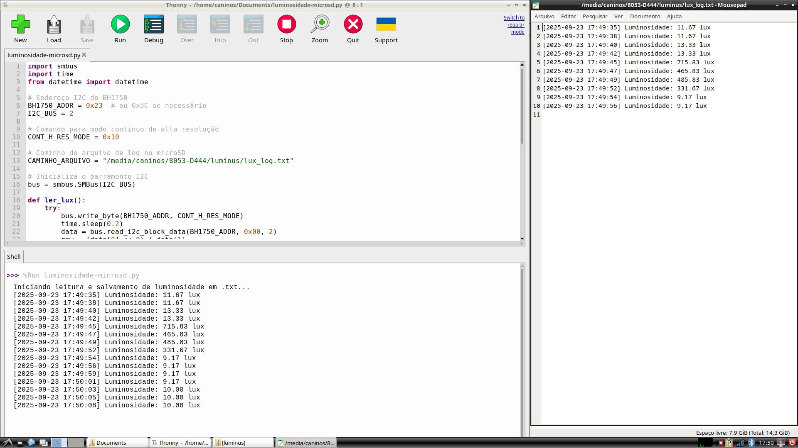
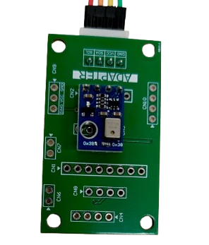
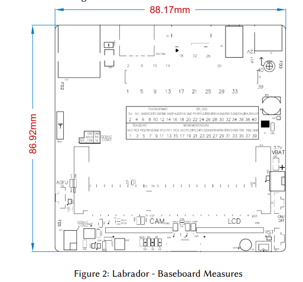
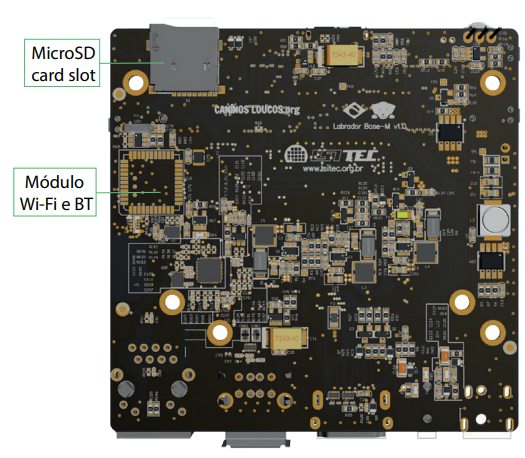
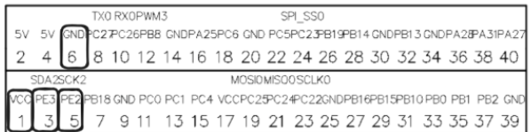

<!-- Improved compatibility of back to top link: See: https://github.com/othneildrew/Best-README-Template/pull/73 -->
<a name="top"></a>

<!-- PROJECT SHIELDS -->
[![Contributors][contributors-shield]][contributors-url]
[![Forks][forks-shield]][forks-url]
[![Stargazers][stars-shield]][stars-url]
[![Issues][issues-shield]][issues-url]
[![MIT License][license-shield]][license-url]
[![LinkedIn][linkedin-shield]][linkedin-url]

<!-- PROJECT LOGO -->
<br/>
<h3 align="center">Datalogger BH1750 - Caninos Labrador</h3>

  <p align="center">
    Sistema de monitoramento de luminosidade usando sensor BH1750 e placa Caninos Labrador com logging automático de dados
    <br/>
    <br />
    <a href="https://github.com/HeitorLouzeiroRepositoryIFPI/embarca-caninos-datalogger/issues">Reportar Bug</a>
    ·
    <a href="https://github.com/HeitorLouzeiroRepositoryIFPI/embarca-caninos-datalogger/issues">Solicitar Feature</a>
  </p>
</div>

<!-- TABLE OF CONTENTS -->
<details>
  <summary>Índice</summary>
  <ol>
    <li>
      <a href="#about-the-project">Sobre o Projeto</a>
      <ul>
        <li><a href="#built-with">Tecnologias Utilizadas</a></li>
        <li><a href="#features">Funcionalidades</a></li>
      </ul>
    </li>
    <li><a href="#demonstração">Demonstração</a></li>
    <li><a href="#materials">Materiais e Componentes</a></li>
    <li><a href="#wiring">Esquema de Conexão</a></li>
    <li>
      <a href="#getting-started">Como Começar</a>
      <ul>
        <li><a href="#prerequisites">Pré-requisitos</a></li>
        <li><a href="#installation">Instalação</a></li>
        <li><a href="#configuration">Configuração</a></li>
      </ul>
    </li>
    <li><a href="#usage">Como Usar</a></li>
    <li><a href="#troubleshooting">Solução de Problemas</a></li>
    <li><a href="#roadmap">Roadmap</a></li>
    <li><a href="#contributing">Contribuindo</a></li>
    <li><a href="#license">Licença</a></li>
    <li><a href="#contact">Contato</a></li>
  </ol>
</details>

<!-- ABOUT THE PROJECT -->
## Sobre o Projeto

O **Datalogger BH1750 - Caninos Labrador** é um sistema de monitoramento de luminosidade que utiliza o sensor BH1750 conectado à placa Caninos Labrador via protocolo I2C. O sistema realiza leituras automáticas da luminosidade ambiente e armazena os dados em arquivos de texto organizados por timestamp, ideal para estudos de iluminação, automação residencial e projetos IoT.

### 🎯 Principais Características:
- **Monitoramento contínuo** de luminosidade com sensor de alta precisão
- **Logging automático** com timestamp em arquivos de texto
- **Comunicação I2C** otimizada para baixo consumo
- **Armazenamento em microSD** para grande capacidade de dados
- **Interface simples** através do Thonny IDE
- **Tratamento robusto de erros** para operação ininterrupta

<p align="right">(<a href="#top">voltar ao topo</a>)</p>

<!-- USAGE EXAMPLES -->
## Demonstração

### 🖥️ Interface de Desenvolvimento


### 📡 Sensor BH1750


### 📊 Dataset Caninos Labrador


### 💾 Armazenamento em MicroSD


<p align="right">(<a href="#top">voltar ao topo</a>)</p>

### Tecnologias Utilizadas

**Hardware:**
* [![Caninos Labrador][Caninos]][Caninos-url] - Placa de desenvolvimento
* [![BH1750][BH1750]][BH1750-url] - Sensor de luminosidade I2C
* [![I2C Protocol][I2C]][I2C-url] - Protocolo de comunicação

**Software:**
* [![Python][Python]][Python-url] - Linguagem de programação
* [![Thonny][Thonny]][Thonny-url] - IDE Python simplificada
* [![SMBus][SMBus]][SMBus-url] - Biblioteca para comunicação I2C

<p align="right">(<a href="#top">voltar ao topo</a>)</p>

### Funcionalidades

#### 📊 Monitoramento:
- ✅ Leitura contínua de luminosidade (0-65535 lux)
- ✅ Intervalos configuráveis de amostragem
- ✅ Precisão de ±20% com resolução de 1 lux

#### 💾 Armazenamento:
- ✅ Logging automático com timestamp
- ✅ Arquivo de texto estruturado
- ✅ Suporte a microSD para grande capacidade
- ✅ Rotação automática de logs (opcional)

#### � Operação:
- ✅ Interface via Thonny IDE
- ✅ Tratamento de erros robusto
- ✅ Finalização controlada (Ctrl+C)
- ✅ Configuração flexível de parâmetros

<p align="right">(<a href="#top">voltar ao topo</a>)</p>

## Materiais e Componentes

### Hardware Necessário:
- **Caninos Labrador** - Placa de desenvolvimento com I2C disponível
- **Sensor BH1750** - Sensor de luminosidade digital I2C
- **Cabos jumper** - Para conexões VCC, GND, SDA, SCL  
- **MicroSD Card** - Para armazenamento de dados (opcional)
- **Fonte de alimentação** - 3.3V ou 5V conforme módulo BH1750

### Software Necessário:
- **Python 3** com biblioteca smbus
- **Thonny IDE**
- **i2c-tools** para diagnóstico

<p align="right">(<a href="#top">voltar ao topo</a>)</p>

## Esquema de Conexão

### 🔌 Pinagem da Caninos Labrador

A placa Caninos Labrador possui um conector de 40 pinos. Para este projeto, utilizaremos os pinos I2C:



| Função | Pino | Descrição |
|--------|------|-----------|
| **VCC** | 1 | Alimentação 3.3V |
| **SDA** | 3 (PE3) | Linha de dados I2C |
| **SCL** | 5 (PE2) | Linha de clock I2C |
| **GND** | 6 | Terra/Referência |

### 📡 Sensor BH1750 - Luminosidade


### 🔗 Conexões do Sensor BH1750

| BH1750 | Caninos Labrador | Descrição |
|--------|------------------|-----------|
| VCC | Pino 1 (3.3V) | Alimentação |
| GND | Pino 6 (GND) | Terra |
| SDA | Pino 3 (PE3) | Dados I2C |
| SCL | Pino 5 (PE2) | Clock I2C |

### ⚠️ Observações Importantes:
- Mantenha cabos curtos para evitar interferências
- Endereço I2C padrão: `0x23` (alguns módulos podem usar `0x5C`)
- Certifique-se de conexão GND comum entre todos os componentes

<p align="right">(<a href="#top">voltar ao topo</a>)</p>

<!-- GETTING STARTED -->
## Como Começar

### Pré-requisitos

Certifique-se de que os seguintes componentes estão disponíveis:

**Sistema Operacional:**
* Sistema Linux (Caninos Labrador)
* Acesso sudo para instalação de pacotes

**Ferramentas de Desenvolvimento:**
* Python 3.x
* Acesso aos barramentos I2C (/dev/i2c-0 a /dev/i2c-3)

### Instalação

#### 1. Clone o repositório
```sh
git clone https://github.com/HeitorLouzeiroRepositoryIFPI/embarca-caninos-datalogger.git
cd embarca-caninos-datalogger
```

#### 2. Instale as ferramentas I2C
```sh
sudo apt-get update
sudo apt-get install -y i2c-tools
```

#### 3. Verifique os barramentos I2C disponíveis
```sh
ls /dev/i2c*
```
Saída esperada:
```
/dev/i2c-0  /dev/i2c-1  /dev/i2c-2  /dev/i2c-3
```

#### 4. Instale o suporte I2C para Python
```sh
sudo apt install -y python3-smbus
```

#### 5. Configure permissões de acesso
```sh
sudo usermod -aG i2c $USER
```

#### 6. Instale o Thonny IDE
```sh
sudo apt install -y thonny
```

⚠️ **Importante:** Reinicie o sistema após configurar as permissões.

### Configuração

#### 1. Verificação do Sensor
Confirme que o sensor está conectado corretamente:
```sh

i2cdetect -y 2  # Substitua pelo barramento correto
```

Exemplo de resultado esperado:
```
     0  1  2  3  4  5  6  7  8  9  a  b  c  d  e  f
00:          -- -- -- -- -- -- -- -- -- -- -- -- -- 
10: -- -- -- -- -- -- -- -- -- -- -- -- -- -- -- -- 
20: -- -- -- 23 -- -- -- -- -- -- -- -- -- -- -- -- 
30: -- -- -- -- -- -- -- -- -- -- -- -- -- -- -- -- 
```
✅ BH1750 encontrado no endereço `0x23`

#### 2. Configuração do Thonny
1. Abra o Thonny
2. Vá em **Ferramentas > Opções > Interpretador**
3. Selecione **"Python 3 (local)"**

#### 3. Preparação do MicroSD (Opcional)
```sh
# Identifique o dispositivo
lsblk -f

# Monte o microSD
sudo mkdir -p /media/microsd
sudo mount /dev/sdX1 /media/microsd
sudo chown $USER:$USER /media/microsd
```

<p align="right">(<a href="#top">voltar ao topo</a>)</p>

<!-- USAGE EXAMPLES -->
## Como Usar

### 💻 Executando o Datalogger

#### Pelo Thonny IDE:


1. Abra o **Thonny**
2. Abra o arquivo `BH1750_logger.py`
3. Ajuste os parâmetros se necessário:
   ```python
   BH1750_ADDR = 0x23              # Endereço I2C do sensor
   I2C_BUS = 2                     # Barramento I2C utilizado
   CONT_H_RES_MODE = 0x10          # Modo contínuo alta resolução
   CAMINHO_ARQUIVO = "/caminho/para/log.txt"  # Local do arquivo de log
   ```
4. Clique em **"Executar" (F5)**
5. Acompanhe as leituras no console
6. Interrompa com **Ctrl+C**

#### Pela linha de comando:
```sh
cd embarca-caninos-datalogger
python3 BH1750_logger.py
```

### 📊 Formato dos Dados

Os dados são salvos no seguinte formato:
```
[2024-09-25 14:30:25] Luminosidade: 245.67 lux
[2024-09-25 14:30:27] Luminosidade: 248.12 lux
[2024-09-25 14:30:29] Luminosidade: 251.03 lux
```

### ⚙️ Parâmetros Configuráveis

| Parâmetro | Padrão | Descrição |
|-----------|--------|-----------|
| `BH1750_ADDR` | `0x23` | Endereço I2C do sensor |
| `I2C_BUS` | `2` | Barramento I2C utilizado |
| `CONT_H_RES_MODE` | `0x10` | Modo de alta resolução |
| `CAMINHO_ARQUIVO` | `/media/...` | Local do arquivo de log |
| Intervalo | `2s` | Tempo entre leituras |

### 🔄 Fluxo de Operação

1. **Inicialização:** Configura barramento I2C
2. **Leitura:** Envia comando ao sensor e aguarda resposta
3. **Conversão:** Transforma dados brutos em valor lux (÷ 1.2)
4. **Registro:** Formata com timestamp e salva no arquivo
5. **Repetição:** Aguarda intervalo e repete o ciclo

### 💾 Armazenamento no MicroSD


### 💾 Boas Práticas para Armazenamento

- **Organize por data:** Crie subpastas como `logs_BH1750/2024-09-25/`
- **Monitore espaço:** Verifique periodicamente o espaço livre no microSD
- **Rotação de logs:** Remova ou arquive logs antigos regularmente
- **Backup:** Mantenha cópias dos dados importantes

<p align="right">(<a href="#top">voltar ao topo</a>)</p>

## Solução de Problemas

### ❌ Problemas Comuns

#### `PermissionError` ao acessar I2C
**Solução:**
```sh
sudo usermod -aG i2c $USER
# Faça logout e login novamente
```

#### `ModuleNotFoundError: smbus`
**Solução:**
```sh
sudo apt install -y python3-smbus
```

#### `OSError: No such device or address`
**Possíveis causas:**
- Barramento I2C incorreto (verifique com `i2cdetect`)
- Cabeamento SDA/SCL invertido
- Sensor não alimentado corretamente

#### Arquivo não salvo no microSD
**Verificações:**
- Confirme se o microSD está montado
- Verifique permissões do diretório
- Certifique-se de que há espaço livre suficiente

<p align="right">(<a href="#top">voltar ao topo</a>)</p>

<!-- ROADMAP -->
## Roadmap

### ✅ Funcionalidades Implementadas:
- [x] Comunicação I2C com BH1750
- [x] Logging com timestamp
- [x] Armazenamento em arquivo de texto
- [x] Tratamento básico de erros
- [x] Interface via Thonny IDE


Veja as [issues abertas](https://github.com/HeitorLouzeiroRepositoryIFPI/embarca-caninos-datalogger/issues) para uma lista completa de recursos propostos e problemas conhecidos.

<p align="right">(<a href="#top">voltar ao topo</a>)</p>

<!-- CONTRIBUTING -->
## Contribuindo

Contribuições são o que fazem a comunidade open source um lugar incrível para aprender, inspirar e criar. Qualquer contribuição que você fizer será **muito apreciada**.

Se você tem uma sugestão que tornaria este projeto melhor, por favor faça um fork do repositório e crie um pull request. Você também pode simplesmente abrir uma issue com a tag "enhancement".
Não esqueça de dar uma estrela ao projeto! Obrigado novamente!

1. Faça um Fork do Projeto
2. Crie sua Feature Branch (`git checkout -b feature/NovaFuncionalidade`)
3. Commit suas mudanças (`git commit -m 'Add: Nova funcionalidade incrível'`)
4. Push para a Branch (`git push origin feature/NovaFuncionalidade`)
5. Abra um Pull Request

### 📋 Diretrizes de Contribuição:
- Mantenha o código limpo e bem documentado
- Teste suas modificações antes de enviar
- Siga as convenções de nomenclatura existentes
- Documente novas funcionalidades no README

<p align="right">(<a href="#top">voltar ao topo</a>)</p>

## Colaboradores

Agradecemos às seguintes pessoas que contribuíram para este projeto:

<table>
  <tr>
    <td align="center">
      <a href="#">
        <br>
        <sub>
          <b>Heitor Louzeiro</b>
        </sub>
      </a>
    </td>
  </tr>
</table>

<p align="right">(<a href="#top">voltar ao topo</a>)</p>

<!-- LICENSE -->
## Licença

Distribuído sob a Licença MIT. Veja [LICENSE](LICENSE) para mais informações.

<p align="right">(<a href="#top">voltar ao topo</a>)</p>

<!-- CONTACT -->
## Contato

<div align='center'>  
  <a href="https://www.instagram.com/heitorlouzeiro/" target="_blank">
    
  </a> 
  <a href = "mailto:heitorlouzeirodev@gmail.com">
        
  </a>
  <a href="https://www.linkedin.com/in/heitor-louzeiro/" target="_blank">
    
  </a> 
</div>

**Project Link:** [https://github.com/HeitorLouzeiroRepositoryIFPI/embarca-caninos-datalogger](https://github.com/HeitorLouzeiroRepositoryIFPI/embarca-caninos-datalogger)

---

<!-- MARKDOWN LINKS & IMAGES -->
[contributors-shield]: https://img.shields.io/github/contributors/HeitorLouzeiroRepositoryIFPI/embarca-caninos-datalogger.svg?style=for-the-badge
[contributors-url]: https://github.com/HeitorLouzeiroRepositoryIFPI/embarca-caninos-datalogger/graphs/contributors
[forks-shield]: https://img.shields.io/github/forks/HeitorLouzeiroRepositoryIFPI/embarca-caninos-datalogger.svg?style=for-the-badge
[forks-url]: https://github.com/HeitorLouzeiroRepositoryIFPI/embarca-caninos-datalogger/network/members
[stars-shield]: https://img.shields.io/github/stars/HeitorLouzeiroRepositoryIFPI/embarca-caninos-datalogger.svg?style=for-the-badge
[stars-url]: https://github.com/HeitorLouzeiroRepositoryIFPI/embarca-caninos-datalogger/stargazers
[issues-shield]: https://img.shields.io/github/issues/HeitorLouzeiroRepositoryIFPI/embarca-caninos-datalogger.svg?style=for-the-badge
[issues-url]: https://github.com/HeitorLouzeiroRepositoryIFPI/embarca-caninos-datalogger/issues
[license-shield]: https://img.shields.io/github/license/HeitorLouzeiroRepositoryIFPI/embarca-caninos-datalogger.svg?style=for-the-badge
[license-url]: https://github.com/HeitorLouzeiroRepositoryIFPI/embarca-caninos-datalogger/blob/main/LICENSE
[linkedin-shield]: https://img.shields.io/badge/-LinkedIn-black.svg?style=for-the-badge&logo=linkedin&colorB=555
[linkedin-url]: https://linkedin.com/in/heitor-louzeiro

[Python]: https://img.shields.io/badge/Python-14354C?style=for-the-badge&logo=python&logoColor=white
[Python-url]: https://www.python.org/

[Caninos]: https://img.shields.io/badge/Caninos_Labrador-FF6B35?style=for-the-badge&logo=raspberry-pi&logoColor=white
[Caninos-url]: https://caninos.org/

[BH1750]: https://img.shields.io/badge/BH1750-4CAF50?style=for-the-badge&logo=sensors&logoColor=white
[BH1750-url]: https://www.mouser.com/datasheet/2/348/bh1750fvi-e-186247.pdf

[I2C]: https://img.shields.io/badge/I2C_Protocol-009688?style=for-the-badge&logo=protocol&logoColor=white
[I2C-url]: https://en.wikipedia.org/wiki/I%C2%B2C

[Thonny]: https://img.shields.io/badge/Thonny_IDE-3776AB?style=for-the-badge&logo=python&logoColor=white
[Thonny-url]: https://thonny.org/

[SMBus]: https://img.shields.io/badge/SMBus-FF9800?style=for-the-badge&logo=python&logoColor=white
[SMBus-url]: https://pypi.org/project/smbus2/